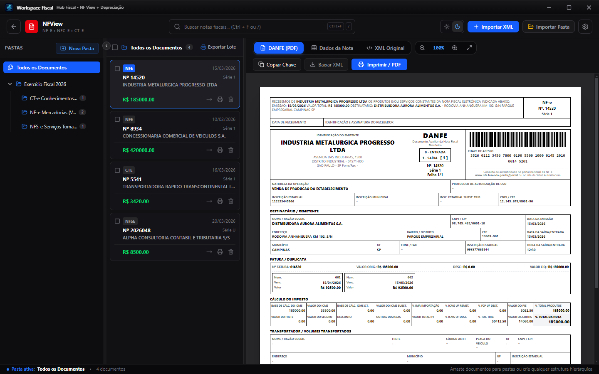
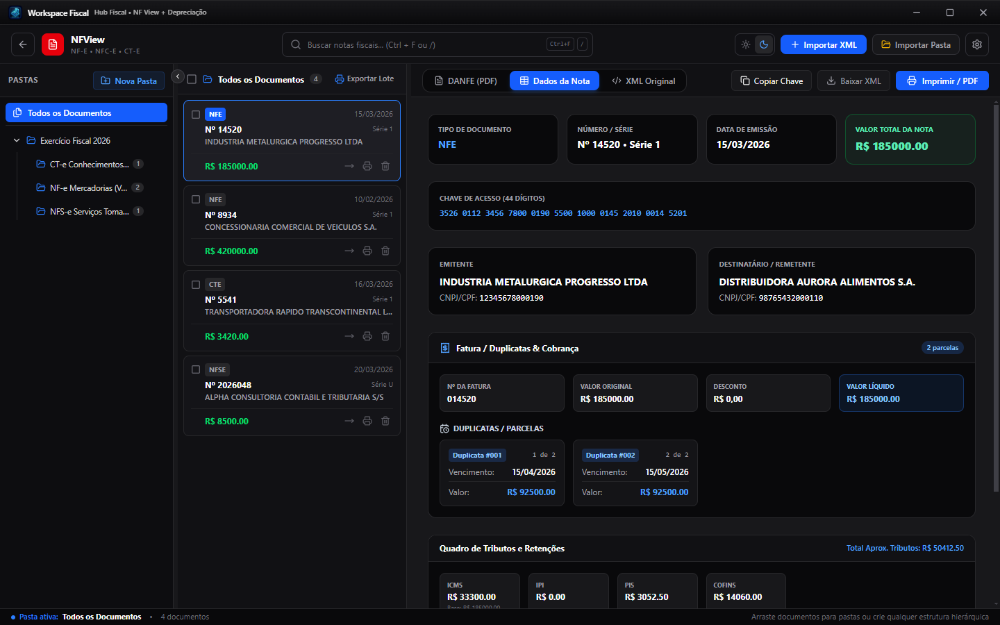
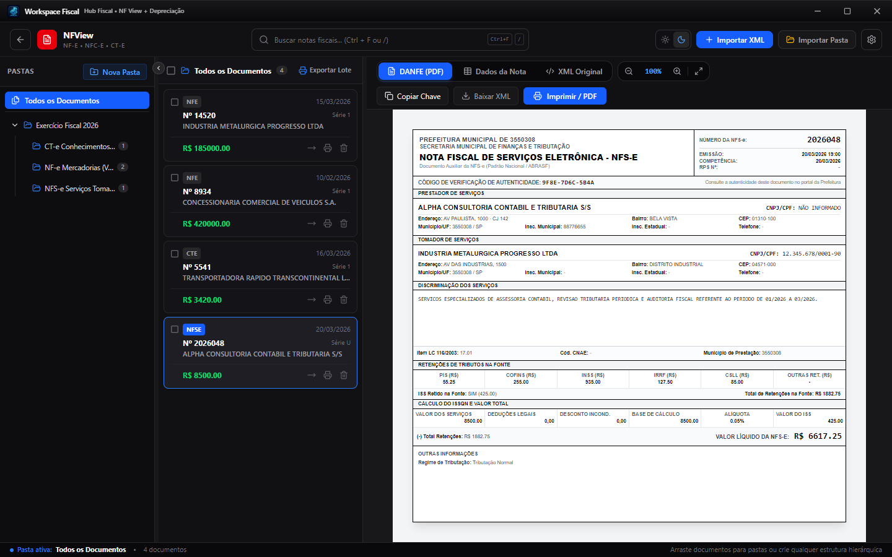
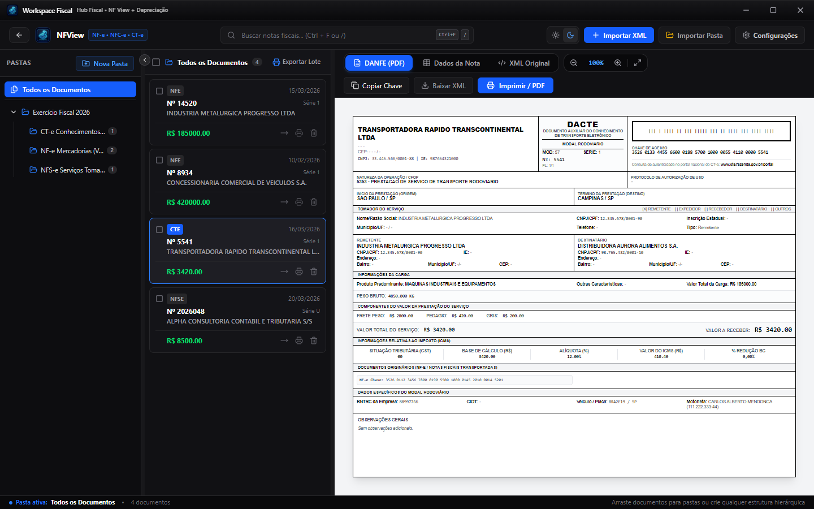
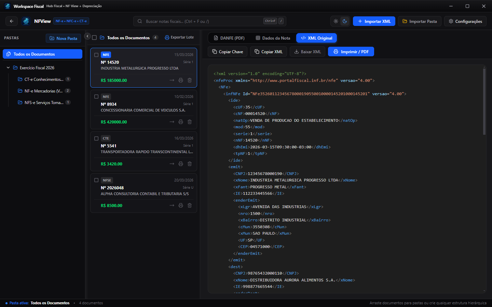
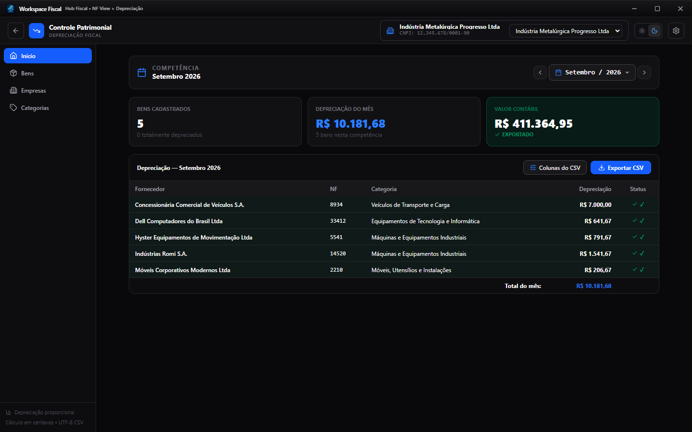
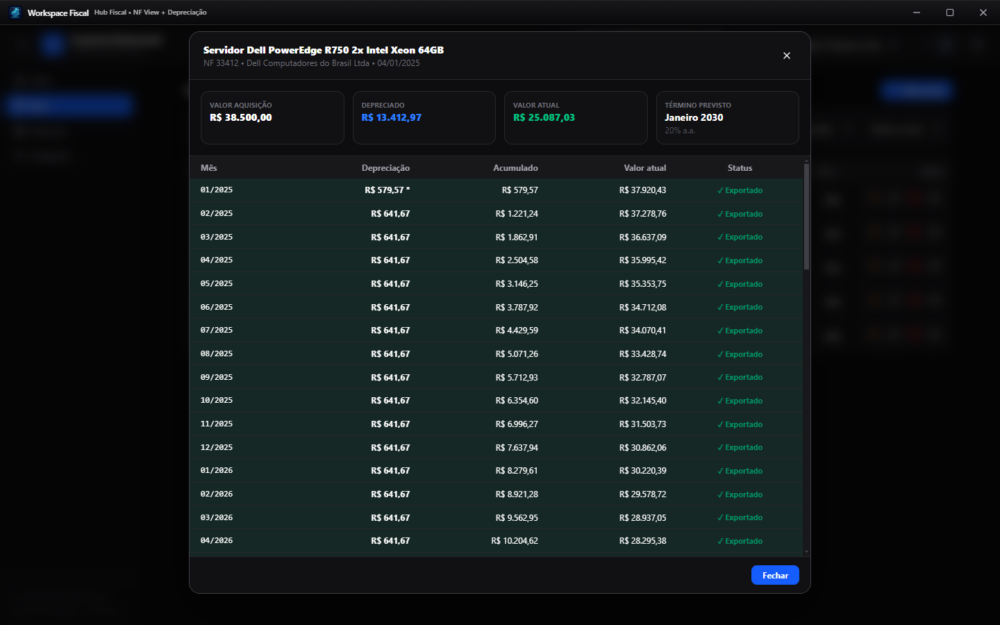
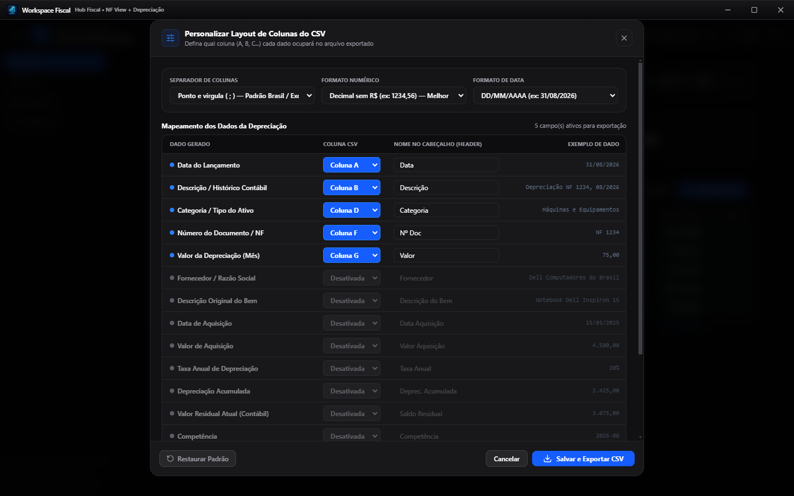
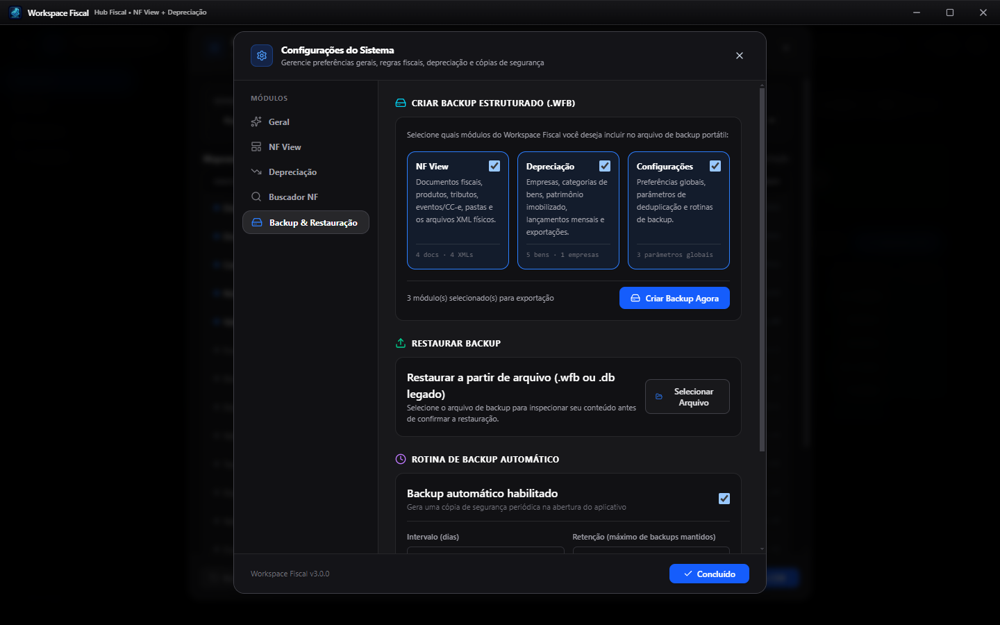

# Workspace Fiscal

Hub desktop corporativo para gestão, visualização, auditoria e impressão de documentos fiscais eletrônicos brasileiros e controle patrimonial com cálculo linear de depreciação de ativos imobilizados.

Repositório: [https://github.com/sAlly-19/workspace-fiscal](https://github.com/sAlly-19/workspace-fiscal)  
Versão: **3.0.0**

---

## 📌 Sumário

- [Visão Geral](#visão-geral)
- [Galeria de Telas](#galeria-de-telas)
- [Principais Módulos](#principais-módulos)
  - [1. Hub Principal Unificado](#1-hub-principal-unificado)
  - [2. NF View (Documentos Fiscais Eletrônicos)](#2-nf-view-documentos-fiscais-eletrônicos)
  - [3. Depreciação Fiscal & Ativo Imobilizado](#3-depreciação-fiscal--ativo-imobilizado)
  - [4. Buscador NF (Consulta e Distribuição SEFAZ)](#4-buscador-nf-consulta-e-distribuição-sefaz)
  - [5. Central de Configurações Modular](#5-central-de-configurações-modular)
  - [6. Sistema de Backup Estruturado e Restauração Segura (.wfb)](#6-sistema-de-backup-estruturado-e-restauração-segura-wfb)
  - [7. Sistema de Atualização Integrada](#7-sistema-de-atualização-integrada)
- [Formatos e Modelos Suportados](#formatos-e-modelos-suportados)
- [Arquitetura e Tecnologias](#arquitetura-e-tecnologias)
- [Estrutura do Projeto](#estrutura-do-projeto)
- [Instalação e Execução](#instalação-e-execução)
  - [Pré-requisitos](#pré-requisitos)
  - [Instalação](#instalação)
  - [Modo de Desenvolvimento](#modo-de-desenvolvimento)
  - [Build e Empacotamento](#build-e-empacotamento)
  - [Testes Automatizados](#testes-automatizados)
  - [Validação de Tipos](#validação-de-tipos)
- [Segurança e Privacidade](#segurança-e-privacidade)
- [Licença e Autoria](#licença-e-autoria)

---

## Visão Geral

O **Workspace Fiscal** é uma aplicação desktop corporativa de alta performance construída para escritórios de contabilidade, setores fiscais e departamentos financeiros. A solução unifica a leitura e organização de arquivos fiscais XML, um motor contábil para controle de quotas de depreciação do ativo permanente, e a consulta e sincronização automatizada de NF-e e CT-e diretamente com a SEFAZ Nacional via certificados digitais ICP-Brasil (A1), funcionando com banco de dados local SQLite de alta velocidade.

---

## Galeria de Telas

### Hub Principal do Sistema
Acesso centralizado aos módulos do sistema, contadores em tempo real de documentos e ativos patrimoniais, e atalhos rápidos.


---

### NF View — Gestão de Documentos Fiscais & Visualização DANFE
Árvore de pastas do workspace, busca instantânea, badges por modelo fiscal (NF-e, NFC-e, CT-e, NFS-e) e visualização fiel aos padrões SEFAZ.



---

### NF View — Quadro Analítico de Dados da Nota
Detalhamento de dados cadastrais de emitente e destinatário, chave de acesso, duplicatas com vencimento e partição de tributos (ICMS, PIS, COFINS).



---

### NF View — Visualização Oficial de NFS-e (DANFSE)
Layout padrão nacional/ABRASF para serviços tomados e prestados com discriminação e retenções na fonte (PIS, COFINS, INSS, IRRF, CSLL e ISS).



---

### NF View — Visualização Oficial de CT-e (DACTE)
Layout rodoviário completo para conhecimentos de transporte de carga com dados do frete (peso, valor, pedágio, GRIS), motorista, placa e RNTRC.



---

### NF View — Visualizador Técnico de Código XML
Exibição do código-fonte XML original com destaque de sintaxe, formatação automática, identificação de tags e ações para cópia e download.



---

### Depreciação — Painel Geral de Ativos e Competência
Painel contábil com acompanhamento de bens cadastrados, depreciação do mês, valor contábil líquido acumulado e seletor rápido de competência.



---

### Depreciação — Detalhamento do Bem e Cronograma Mensal
Quotas de depreciação calculadas mês a mês em centavos, ajuste proporcional (*pro-rata die*) no 1º mês, valor residual e status de lançamento.



---

### Depreciação — Configurador Avançado de Layout de Colunas CSV
Personalização visual das colunas, delimitadores de campo (ponto e vírgula ou vírgula), formatos numéricos e máscaras de data para integração contábil.



---

### Central de Configurações — Backup Estruturado e Restauração Segura (.wfb)
Seleção modular de dados para backup, inspeção prévia com contadores reais de notas e bens, e restauração atômica com backup prévio de segurança.



---

## Principais Módulos

### 1. Hub Principal Unificado
- Interface inicial com alternância ágil entre os 3 módulos: **NF View**, **Depreciação Fiscal** e **Buscador NF** (apresentados horizontalmente na tela de módulos).
- Contadores em tempo real da quantidade de documentos armazenados, pastas ativas, bens imobilizados e empresas cadastradas.
- Atalhos universais pelo teclado (`Ctrl+K` para busca e navegação global).

---

### 2. NF View (Documentos Fiscais Eletrônicos)
- **Visualizadores e Impressão Fiéis aos Padrões Oficiais:**
  - **DANFE (NF-e - Modelo 55):** Layout monocromático oficial SEFAZ com código de barras Code 128, chave de acesso de 44 dígitos, quadro de impostos (ICMS, IPI, PIS, COFINS, ST), transportadora, volumes, duplicatas/faturas e produtos com NCM, CFOP, CST e alíquotas.
  - **DANFE NFC-e (Modelo 65):** Layout de cupom fiscal para consumidor com detalhamento de itens e totais.
  - **DANFSE (NFS-e - Padrão Nacional / ABRASF):** Layout para prestação de serviços com destaque aos tributos retidos na fonte (PIS, COFINS, INSS, IRRF, CSLL, ISS Retido e Outras Retenções) e dados cadastrais das partes.
  - **DACTE (CT-e - Modelo 57):** Layout para transporte rodoviário de cargas contendo tomador, componentes tarifários do frete (Frete Peso, Frete Valor, Pedágio, GRIS), tributação do ICMS, características da carga, documentos originários vinculados e identificação do veículo/motorista.
- **Importação Flexível e em Lote:**
  - Importação de arquivos XML individuais via seleção ou arrastar e soltar (drag & drop).
  - Importação de diretórios completos com varredura recursiva de subpastas.
  - Descompactação automática de arquivos compactados em formato `.zip`.
- **Organização Hierárquica em Árvore (Workspaces):**
  - Criação, renomeação e exclusão de pastas estruturadas.
  - Movimentação de documentos individualmente ou em lote entre pastas.
  - Seleção múltipla para ações em massa (impressão unificada em A4, exportação ou exclusão).
- **Pesquisa e Filtros:**
  - Busca instantânea por número do documento, razão social, CNPJ/CPF ou chave de acesso.
- **Visualizador Técnico de XML:**
  - Aba técnica com realce de sintaxe colorido, numeração de linhas e ações rápidas para copiar o código ou baixar o arquivo.

---

### 3. Depreciação Fiscal & Ativo Imobilizado
- **Gestão Multiempresa:**
  - Cadastro de múltiplas empresas por Razão Social, Nome Fantasia e CNPJ.
  - Regras de depreciação contábil configuráveis por empresa ativa (*Proporcional aos dias*, *Mês cheio de aquisição* ou *Mês subsequente*).
- **Categorização Contábil:**
  - Grupos de ativos com taxas de depreciação anual (%) e vida útil pré-definida (Máquinas e Equipamentos, Veículos, Equipamentos de Informática, Móveis e Utensílios, Edificações).
- **Motor Linear em Centavos:**
  - Cálculo estritamente em números inteiros (centavos), eliminando imprecisões e desvios de arredondamento de ponto flutuante (*float*).
  - Cálculo proporcional (*pro-rata die*) no primeiro mês considerando os dias restantes a partir da data de aquisição.
  - Ajuste residual automático de centavos na última competência para zerar a diferença em relação ao valor depreciável total.
- **Histórico e Quotas Retroativas:**
  - Geração automática e em lote do histórico de competências passadas para bens com data de aquisição anterior à competência ativa.
- **Controle de Baixa e Reativação:**
  - Registro de baixa patrimonial por motivo de venda, perda, descarte ou sucata com data de cessação de quotas.
  - Opção para reativação imediata de bens baixados.
- **Configuração e Exportação CSV Personalizada:**
  - Mapeamento dinâmico de colunas para adequação a qualquer software contábil (ex.: Domínio Sistemas).
  - Customização de separadores (`;` ou `,`), padrões monetários (brasileiro `1.234,56` ou internacional `1234.56`) e formatação de datas.

---

### 4. Buscador NF (Consulta e Distribuição SEFAZ)
- **Consulta e Distribuição Oficial SEFAZ:**
  - Comunicação nativa com os Web Services oficiais de Distribuição de DF-e de Interesse dos Atores (NF-e e CT-e).
  - Consulta incremental baseada em NSU (Número Seqüencial Único), registrando o `ultNSU` e o `maxNSU` por empresa.
  - Prevenção automática e inteligente contra consumo indevido (*cStat 656*), respeitando as diretrizes e intervalos de requisições da SEFAZ.
- **Certificados Digitais ICP-Brasil (A1):**
  - Suporte completo a certificados digitais modelo A1 (`.pfx` / `.p12`) com senha protegida.
  - Leitura segura em memória e armazenamento protegido de chaves e cadeias criptográficas no banco local.
  - Validação instantânea de vigência, titularidade e CNPJ vinculado ao certificado.
- **Download e Organização de Arquivos XML:**
  - Descompactação automática de documentos em `gzip` retornados no lote da SEFAZ.
  - Armazenamento físico automático no diretório configurado pelo usuário.
  - Exportação em lote de XMLs com geração de arquivos `.zip` organizados.
- **Ambientes de Operação:**
  - Alternância facilitada entre ambientes de **Produção** e **Homologação**.
- **Histórico e Consulta Local:**
  - Tabela interativa com busca, filtros por status, data, emitente e chave de acesso.
  - Ações rápidas para download individual do XML, visualização e conferência.

---

### 5. Central de Configurações Modular
Organizada em 5 abas especializadas:
- **Geral:** Gestão de tema visual (Claro, Escuro e Sistema), mapa de atalhos de teclado e informações de versão.
- **NF View:** Preferências visuais da DANFE, políticas de desduplicação de arquivos repetidos na importação, e manutenção da base de documentos fiscais.
- **Depreciação:** Regra padrão de início de depreciação da empresa ativa, padrões de formatação numérica e monetária para exportações CSV e atalho ao configurador de colunas.
- **Buscador NF:** Configuração do diretório de salvamento dos XMLs baixados, gerenciamento de certificados digitais A1 e alternância de ambiente (Produção / Homologação).
- **Backup & Restauração:** Criação de cópias sob demanda, restauração assistida com inspeção prévia e agendamento periódico com regras de retenção.

---

### 6. Sistema de Backup Estruturado e Restauração Segura (.wfb)
- **Pacote Autocontido `.wfb`:**
  - Arquivo compactado contendo metadados completos (`manifest.json`), base de dados SQLite consistente e todos os arquivos XML físicos do NF View.
- **Inspeção Prévia com Contadores Reais:**
  - Antes de executar a restauração, o sistema inspeciona o arquivo e apresenta ao usuário os totais exatos de notas, eventos fiscais, empresas, bens e competências contidas no backup.
- **Restauração Seletiva:**
  - Permite restaurar seletivamente os módulos desejados (**NF View**, **Depreciação** e/ou **Configurações Gerais**).
- **Proteção por Backup de Emergência Automático:**
  - Antes de qualquer escrita durante a restauração, o sistema gera compulsoriamente um snapshot de segurança do estado atual do banco.
- **Transação Atômica com Rollback:**
  - Operação sob transação única do SQLite. Qualquer falha técnica provoca a reversão atômica sem corromper o banco de dados.
- **Portabilidade de Caminhos de XMLs:**
  - Os caminhos originais dos documentos são resolvidos dinamicamente por nome base de arquivo (*basename*), permitindo migração de backups entre computadores e perfis distintos sem perda de vínculos.
- **Compatibilidade Retroativa:**
  - Suporte total para inspeção e importação de bases de dados legadas no formato `.db`.

---

### 7. Sistema de Atualização Integrada
- **Download Interno no Aplicativo:** O instalador é transferido diretamente dentro do Workspace Fiscal, sem necessidade de download manual pelo navegador.
- **Barra de Progresso Real:** Monitoramento em tempo real do percentual e velocidade do download.
- **Instalação e Reinício:** Notificação quando o pacote estiver pronto, aplicando o update e reiniciando a aplicação com um clique.
- **Detecção de Distribuição:** Tratamento adequado para instalações convencionais (NSIS) e executáveis portáteis (*Portable*).

---

## Formatos e Modelos Suportados

| Modelo | Documento | Padrão / Layout | Parser Embutido |
| :---: | :--- | :--- | :--- |
| **55** | **NF-e** (Nota Fiscal Eletrônica de Mercadorias) | SEFAZ Nacional (ProcNFe / NFe v4.00) | `NFeParser` |
| **65** | **NFC-e** (Nota Fiscal de Consumidor Eletrônica) | SEFAZ Estadual | `NFeParser` |
| **57** | **CT-e** (Conhecimento de Transporte Eletrônico) | SEFAZ DACTE Rodoviário v3.00/v4.00 | `CTeParser` |
| **-** | **NFS-e** (Nota Fiscal de Serviços Eletrônica) | Padrão Nacional / ABRASF (CompNfse / Nfse) | `NFSeParser` |
| **-** | **CC-e** (Carta de Correção Eletrônica) | Evento SEFAZ 110110 | `CCeParser` |
| **-** | **ZIP** (Lote Compactado) | Arquivos `.zip` com múltiplos XMLs em pastas | `adm-zip` |
| **-** | **WFB** (Workspace Fiscal Backup) | Pacote estruturado com banco, manifesto e XMLs | `adm-zip` |

---

## Arquitetura e Tecnologias

A aplicação opera localmente no computador do usuário, desacoplando a interface visual em React do processo de dados e API local em Node.js/Express:

```
[ Electron 33 (Desktop Runtime) ]
   ├── [ Webview / Renderer ] ── React 19 + Tailwind CSS 4 + Lucide Icons + Motion
   └── [ Node Main Process ]  ── IPC Seguro + Servidor Local Express
                                    ├── Parsers Fiscais XML (fast-xml-parser)
                                    ├── Motor de Depreciação Linear em Centavos
                                    ├── Motor de Backup Portável (.wfb)
                                    └── Banco Local SQLite (Modo WAL) + Drizzle ORM
```

### Tecnologias Utilizadas

- **Frontend:**
  - React 19
  - TypeScript 5.8
  - Tailwind CSS 4
  - Motion (Framer Motion)
  - Lucide React (Iconografia vetorial)
  - Zustand (Gerenciamento de Estado Global)
  - React Syntax Highlighter (Realce de sintaxe Prism)
  - React Resizable Panels
- **Backend & Processamento:**
  - Node.js & Express 4
  - Fast-XML-Parser (Parser XML performático com preservação de estrutura)
  - Adm-Zip (Compactação e extração de pacotes `.zip` e `.wfb`)
  - Multer (Recepção de payloads de arquivos)
  - Pino & Pino-Pretty (Logging estruturado)
  - Helmet & Rate Limiting (Segurança de rotas internas)
  - Zod (Validação de esquemas e tipagens de entrada)
- **Persistência de Dados:**
  - SQLite (Banco de dados relacional local offline com modo WAL)
  - Drizzle ORM & Drizzle Kit (Mapeamento relacional e migrações tipadas)
  - LibSQL Client
- **Runtime Desktop & Empacotamento:**
  - Electron 33
  - Electron Builder (Instaladores NSIS e executáveis portáteis)
  - Electron Updater (Atualizações automáticas via GitHub Releases)
  - ESBuild (Compilação do processo principal e preload)
- **Qualidade e Testes:**
  - Vitest (Suíte de testes unitários para cálculo contábil, parsers fiscais e rotinas de backup)
  - TypeScript Compiler (`tsc --noEmit`)

---

## Estrutura do Projeto

```
workspace-fiscal/
├── docs/                       # Documentação técnica e capturas de tela do sistema
│   └── screenshots/            # Imagens em alta resolução utilizadas no repositório
├── electron/                   # Processo principal do Electron
│   ├── buscador/               # Handlers IPC exclusivos do módulo Buscador NF
│   ├── main.ts                 # Inicialização da janela, servidor Express e handlers de IPC
│   ├── preload.ts              # Script de contexto seguro exposto ao frontend
│   └── tsconfig.json           # Configuração de compilação do Electron
├── src/
│   ├── api/                    # Servidor local Express
│   │   ├── routes/             # Rotas de documentos, workspace, importação, depreciação e backup
│   │   ├── services/           # Serviços de negócio (importação, cálculo, exportação, backup)
│   │   └── app.ts              # Configuração dos middlewares e rotas Express
│   ├── core/                   # Domínio e regras de negócio
│   │   ├── buscador/           # Motor SEFAZ (distribuição DF-e, certificados A1, NSU e storage)
│   │   ├── parsers/            # Extratores de NF-e, NFC-e, NFS-e e CT-e
│   │   ├── danfe/              # Formatadores de moeda, CNPJ/CPF, chaves e datas
│   │   ├── depreciation/       # Motor linear de cálculo de depreciação em centavos
│   │   └── updater/            # Serviço de integração de atualizações
│   ├── db/                     # Banco de dados local
│   │   ├── schema.ts           # Definição das tabelas em Drizzle ORM
│   │   └── index.ts            # Inicialização, pragmas do SQLite e migrações automáticas
│   └── web/                    # Interface gráfica do usuário (React)
│       ├── components/         # Componentes compartilhados e modais do sistema
│       │   └── settings/       # Abas modulares da Central de Configurações (Geral, NF, Deprec, Buscador)
│       ├── features/           # Módulos funcionais da aplicação
│       │   ├── buscador/       # Módulo Buscador NF (consultas SEFAZ, histórico, splash screen e ações)
│       │   ├── documents/      # Visualizadores DANFE, DANFSE, DACTE e lista de documentos
│       │   ├── depreciation/   # Gestão de bens, cronograma, categorias e exportador CSV
│       │   ├── home/           # Hub inicial do sistema (3 módulos horizontais)
│       │   └── workspace/      # Gerenciador da árvore de pastas fiscais
│       ├── layouts/            # Layout principal e barras de navegação
│       ├── stores/             # Stores Zustand (workspace, depreciação e buscador)
│       └── main.tsx            # Ponto de entrada da aplicação React
├── storage/                    # Diretório local para armazenamento físico de XMLs importados
├── scripts/                    # Scripts utilitários de execução e inicialização
├── package.json                # Metadados do projeto, scripts e dependências
├── vite.config.ts              # Configuração do Vite
└── tsconfig.json               # Configuração do TypeScript
```

---

## Instalação e Execução

### Pré-requisitos

- **Node.js:** Versão 20.x ou superior recomendada.
- **npm:** Versão 10.x ou superior.

### Instalação

Clone o repositório e instale as dependências:

```bash
git clone https://github.com/sAlly-19/workspace-fiscal.git
cd workspace-fiscal
npm install
```

### Modo de Desenvolvimento

Para iniciar o Vite e a janela do Electron simultaneamente em modo de desenvolvimento com hot-reload:

```bash
npm run dev
```

Caso queira executar apenas a interface Web no navegador:

```bash
npm run dev:web
```

### Build e Empacotamento

Para compilar o frontend e os scripts do Electron:

```bash
npm run build
```

Para gerar os pacotes executáveis de produção para Windows (instalador NSIS e executável portátil):

```bash
npm run package
```

Os arquivos compilados estarão disponíveis no diretório `release/`.

### Testes Automatizados

Para executar toda a suíte de testes automatizados:

```bash
npm test
```

### Validação de Tipos

Para verificar a integridade da tipagem TypeScript em todo o projeto:

```bash
npm run lint
```

---

## Segurança e Privacidade

- **Processamento 100% Offline e Local:** Os arquivos XML, cadastros de empresas e ativos patrimoniais são processados e armazenados exclusivamente no banco de dados SQLite local da máquina do usuário.
- **Isolamento de Contexto:** A execução do Electron adota `contextIsolation: true`, `nodeIntegration: false` e sandbox, restringindo o acesso do frontend exclusivamente aos métodos seguros declarados no script de *preload*.
- **Integridade Transacional:** As operações críticas sobre o banco de dados operam com modo WAL (*Write-Ahead Logging*) e transações imediatas para prevenir corrupção em casos de encerramento abrupto do sistema operacional.
- **Sem Telemetria ou Envio Externo:** A aplicação não envia dados fiscais ou contábeis para servidores externos de terceiros.

---

## Licença e Autoria

Desenvolvido para **Workspace Fiscal**.  
Projeto mantido por [sAlly-19](https://github.com/sAlly-19).
